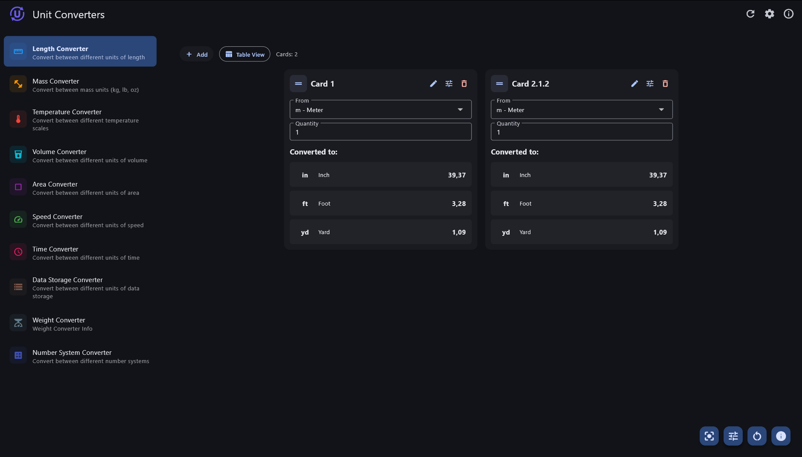
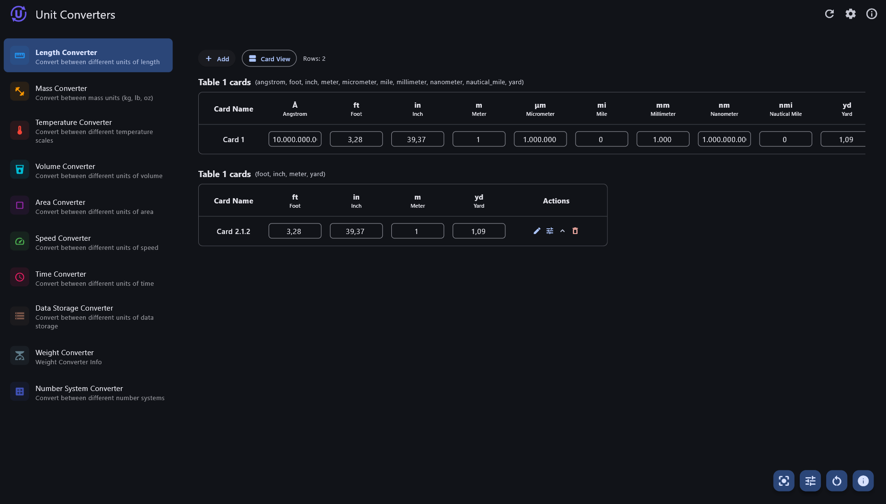
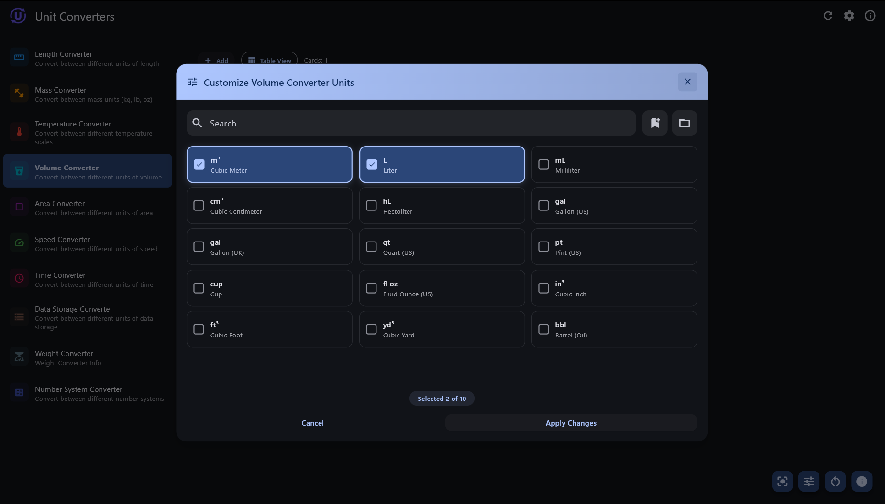

<div align="center">
    
    <h1>Unit Converters</h1>
    <h3>Fast and convenient converter tools with multiple units.</h3> 
</div>

**A powerful collection of unit converters and calculation tools!** A versatile, cross-platform Flutter application designed to provide essential conversion utilities and mathematical tools for daily use - from basic unit conversions to advanced calculations and random generators.

## 📸 Screenshot

<div align="center">
    
    
    
</div>

✨ **Available on Windows, Android, and Web**  
🌍 **Fully localized in English and Vietnamese**  
📱 **Responsive Material Design 3 interface for all screen sizes**

---

## 🚀 Core Features

### 📏 **Unit Conversion Suite** 
*Comprehensive conversion tools for all measurement needs!*

**📐 Length & Distance**
- **Length Converter:** Meters, feet, inches, kilometers, miles, and more
- **Area Converter:** Square meters, acres, hectares, square feet

**⚖️ Weight & Mass**
- **Mass Converter:** Kilograms, pounds, grams, ounces, stones
- **Weight Converter:** Various weight units with precision control

**🌡️ Temperature & Energy**
- **Temperature Converter:** Celsius, Fahrenheit, Kelvin conversions
- **Energy calculations:** Joules, calories, BTU conversions

**💾 Data & Computing**
- **Data Converter:** Bytes, KB, MB, GB, TB conversions
- **Binary calculations:** Bit/byte conversions with precision

**🏃 Speed & Time**
- **Speed Converter:** m/s, km/h, mph, knots, and more
- **Time Converter:** Seconds, minutes, hours, days, years

**🥤 Volume & Capacity**
- **Volume Converter:** Liters, gallons, cups, fluid ounces
- **Liquid measurements:** Metric and imperial systems

### 🔢 **Advanced Tools**
- **Number System Converter:** Binary, decimal, hexadecimal, octal
- **Currency Converter:** Real-time exchange rates (when available)
- **Random Generators:** Numbers, passwords, and various randomization tools

---

## 🏗️ **Technical Architecture**

### 🛠️ **Built with Modern Flutter**
- **Flutter 3.0+:** Cross-platform development with single codebase
- **Material Design 3:** Latest Google design system implementation
- **Responsive Layouts:** Adaptive UI for mobile, tablet, and desktop

### 📚 **Key Dependencies**
- **Hive:** Fast, lightweight local database for settings and history
- **intl:** Internationalization and locale-specific formatting
- **math_expressions:** Mathematical expression parsing and evaluation
- **shared_preferences:** System-level preference storage
- **window_manager:** Desktop window management capabilities

### 🔒 **Security & Privacy**
- **Local Storage:** All data and preferences remain on device
- **Secure Calculations:** Reliable mathematical computations
- **No Tracking:** Zero analytics or user behavior monitoring
- **Offline Capable:** Core functionality works without internet

### 🌐 **Cross-Platform Support**
- **Windows:** Full desktop experience with window management
- **Android:** Native mobile interface with touch optimization
- **Web:** Browser-compatible version with responsive design
- **Future:** iOS and macOS support planned

---

## 🌟 **Key Advantages**

### ⚡ **Performance Optimized**
- Lightning-fast calculations and conversions
- Minimal memory footprint with efficient algorithms
- Smooth 60fps animations and transitions
- Instant startup and response times

### 🎨 **User Experience**
- Intuitive Material Design 3 interface
- Consistent experience across all platforms
- Customizable tool visibility and ordering
- Contextual help and guidance for each converter

### ⚙️ **Highly Configurable**
- Extensive settings for personalizing experience
- Tool-specific configuration options
- Import/export settings for backup
- Decimal precision control for calculations

### 🌐 **Accessibility & Localization**
- Vietnamese and English localization
- Screen reader compatibility
- High contrast mode support
- Keyboard navigation support

---

## 🛠️ **Installation & Setup**

### 🚀 **Getting Started**
1. **Download:** Get the latest release for your platform
2. **Install:** Follow platform-specific installation instructions
3. **Configure:** Set your preferred language, theme, and decimal precision
4. **Customize:** Arrange conversion tools according to your needs

### 🖥️ **System Requirements**
- **Windows:** Windows 10 1903 or later
- **Android:** Android 7.0 (API level 24) or higher
- **Web:** Modern browser with JavaScript enabled
- **RAM:** Minimum 2GB available memory

### 🏗️ **Development Setup**
```bash
# Clone the repository
git clone https://github.com/TrongAJTT/unit-converters.git

# Navigate to project directory
cd unit-converters

# Install dependencies
flutter pub get

# Run the app
flutter run
```

---

## 📁 Project Structure

```
lib/
├── main.dart                    # App entry point and main configuration
├── variables.dart               # Global variables and constants
├── controllers/                 # State management and business logic
├── models/                      # Data models and Hive adapters
│   ├── settings_model.dart      # App settings model
│   └── random_models/           # Random generator state models
├── services/                    # Core services and utilities
│   ├── hive_service.dart        # Database service
│   ├── settings_service.dart    # Settings management
│   ├── cache_service.dart       # Cache management
│   ├── number_format_service.dart # Number formatting
│   └── converter_services/      # Conversion logic services
├── screens/                     # App screens and UI pages
│   ├── converter_tools_screen.dart # Main converter tools screen
│   ├── main_settings.dart       # Settings screen
│   └── about_layout.dart        # About page
├── widgets/                     # Reusable UI components
│   └── generic/                 # Generic reusable widgets
├── layouts/                     # Layout components
├── utils/                       # Helper functions and utilities
├── view_models/                 # View models for MVVM pattern
├── parsers/                     # Data parsing utilities
└── l10n/                        # Localization files
    ├── app_localizations.dart   # Localization setup
    ├── app_en.arb              # English translations
    └── app_vi.arb              # Vietnamese translations
```

---

## 🧮 **Available Converters**

### 📏 **Physical Measurements**
- **Length:** mm, cm, m, km, in, ft, yd, mi, nautical miles
- **Area:** m², km², ft², in², acres, hectares
- **Volume:** L, mL, gal, qt, pt, cup, fl oz, m³, ft³
- **Mass/Weight:** g, kg, lb, oz, stone, ton, metric ton

### 🌡️ **Scientific Units**
- **Temperature:** Celsius, Fahrenheit, Kelvin, Rankine
- **Speed:** m/s, km/h, mph, ft/s, knots, mach
- **Time:** seconds, minutes, hours, days, weeks, months, years

### 💻 **Digital Units**
- **Data Storage:** bit, byte, KB, MB, GB, TB, PB
- **Number Systems:** Binary, Octal, Decimal, Hexadecimal
- **Currency:** Multiple currencies with exchange rates

---

## ❤️ Support This Project

You can support the development of this project via:
- [**GitHub Sponsors**](https://github.com/sponsors/TrongAJTT/)
- [**Buy me a coffee**](https://www.buymeacoffee.com/trongajtt)

Your support helps maintain and improve the application with new features and bug fixes.

## 🤝 Contributing

Contributions are welcome! Feel free to:
- Report bugs and issues
- Suggest new conversion units or tools
- Improve translations (English/Vietnamese)
- Enhance documentation
- Submit pull requests for new features

### 🐛 **Bug Reports**
Please include:
- Device/platform information
- Steps to reproduce the issue
- Expected vs actual behavior
- Screenshots if applicable

### 💡 **Feature Requests**
- Describe the new converter or feature
- Explain the use case and benefits
- Provide examples if possible

---

## 📄 License

This project is licensed under the GPL-3.0 License - see the [LICENSE](LICENSE) file for details.

[](LICENSE)

## 🙏 Credits

Built with love using Flutter and these amazing open-source libraries:
- Flutter SDK
- Hive Database
- Material Design 3
- Window Manager
- Shared Preferences
- And many other wonderful packages

---

<div align="center">
    <p><strong>Made with ❤️ by TrongAJTT</strong></p>
    <p>Star ⭐ this repo if you find it useful!</p>
</div>
